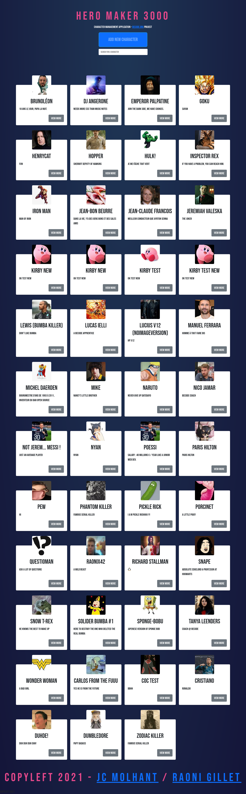

# Character Manager

This repository is the work of [Raoni Gillet](https://github.com/GRaonix) and myself. 
We were asked in the context of a web development course to produce a website that would allow the management of an API handling characters.

We started working on the project on the 21th of October 2021 and had a deadline on the 28th of October and used HTML5, SCSS and JavaScript ES6 to answer to the demand. 

### The objectives

- Use best JS practices
- Read documentation and test a REST API
- Use a REST API with HTTP requests
- Create a typical asynchronous flow : send asynchronous (promises or async/await) requests to a remote server and process the results
- DOM manipulation: changing the DOM based on results of HTTP requests

## The answer

With the use of Bootstrap, we layed out a quick prototype and used modals to generate most of the features.
You can add a character to the API with the "Add New Character" button on top of the page.

Then on each character, there is a "View More" button that leads you to a modal displaying a more in depth description of the character.

You can then edit that character from the same modal or delete it. If you choose to delete it, there is a new modal appearing for confirmation.

### A screenshot of the website

